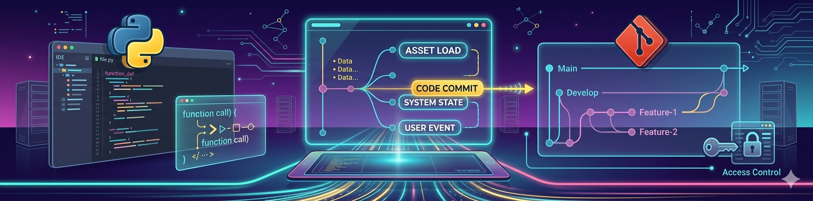

<!-- Banner do Perfil -->

  

<h1 align="center">🗺️ Welcome to Ascension Island</h1>

  Desenvolvedor Fullstack em evolução | Java & Python | Automação | Sistemas de Vendas | IA

---

## 🚀 Developer
Sou um desenvolvedor em constante evolução, apaixonado por criar sistemas úteis — principalmente soluções que realmente melhoram a vida de pessoas e negócios reais.

Hoje estou focado em:

- Desenvolvimento **Java** e **Python**
- Construção de **SaaS** (atualmente: Sistema de Vendas e Estoque)
- Projetos profissionais e freelancing
- Automação para produtividade
- Estruturas sólidas e escaláveis para o futuro
- Inteligência Artificial aplicada ao dia a dia
- LLMs (Large Language Models)
- Automações inteligentes e agentes autônomos
- Integração de IA a sistemas reais (APIs, pipelines, microserviços)

---

## 🛠️ Tech Stack

 

#### 🔴 Back-end & Linguagens

#### 🗄️ Banco de Dados

#### 🤖 Ciência de Dados & ML

#### ⚙️ Ferramentas & DevOps

---

### 🧠 Metodologias & Princípios
* **Agile:** Scrum
* **Qualidade de Código:** Clean Code & Princípios SOLID
* **Testes:** JUnit para Java

---

## 📁 Projetos em Destaque

### 🔹 Sistema Inteligente de Automação Comercial e Produtividade (SIACP)
Projeto desenvolvido em Java com foco em pequenos negócios e vendedores autônomos.
O sistema automatiza tarefas operacionais do dia a dia — desde a coleta e organização de dados até a geração de métricas de desempenho — permitindo que o usuário reduza retrabalho e aumente sua produtividade.

🔗 [Link] (https://github.com/HernandesWolf/Restaurante-landing-page)

---

## ✨ Sobre meus conteúdos

  

---

## 📫 Como falar comigo
- 💼 Linkedin: [ https://www.linkedin.com/in/jussier-ernandes  ](https://www.linkedin.com/in/hernandes-j-barboza-a455232b5/)
- 🐦 X: https://x.com/H_Tech3
- 🐺 GitHub draft: https://github.com/HernandesLobo   
- 📧 Email para contato profissional: jussier30_04@hotmail.com
- 📹 Em breve: Conteúdos no YouTube

---

  

🚀 Construindo o futuro, um commit de cada vez.

